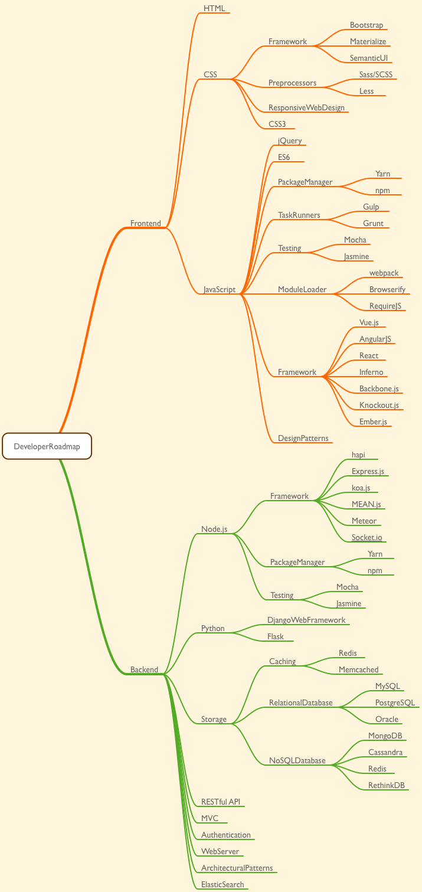

Developer Roadmap
=================

## Backend roadmap

### Python
- Package Manager
    - Pip
- Testing
    - unittest/pyUnit
    - py.test
    - doctest
- Frameworks
    - Django
    - Flask
    - Pyramid
- Async
    - aiohttp
    - gevent
    - Tornado

## Graphical roadmap

    

